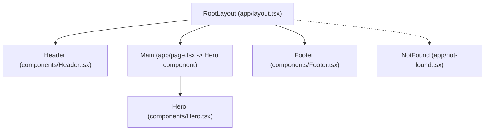

# hi Frontend Architecture

## Introduction

### Background
The “hi” frontend is a Next.js 15 application using the App Router and Tailwind CSS v4. It is configured for static export and currently implements a minimal single-page layout. This document outlines the architecture, component structure, theming approach, and best practices to support a modern, minimalist UI following the Ocean Professional theme.

### Scope
Covers the frontend code organization, theming strategy, and recommended component design patterns to enable maintainability and future extensibility.

## High-Level Architecture

### App Directory Structure
- src/app/layout.tsx: Root layout defining HTML skeleton, metadata, and global styles import.
- src/app/page.tsx: Home page rendering the main content.
- src/app/not-found.tsx: Themed 404 page.
- src/app/globals.css: Global styles and theme variables.

### Build and Tooling
- next.config.ts: output: "export" for static site export.
- postcss.config.mjs: Tailwind v4 via @tailwindcss/postcss.
- eslint.config.mjs: ESLint with next/core-web-vitals and next/typescript.
- package.json: Next.js 15.2.3, React 19, TypeScript 5, Tailwind v4.

## Component Model

### Page-Level Components
- RootLayout: Wraps pages with HTML and body. Responsible for importing globals and exposing metadata. Keep this lean and semantic.
- Home Page: Encapsulates the hero section; future sections can be split into components.
- NotFound: Independent 404 component aligned with theme.

### UI Components (Recommended future structure)
Create a components directory under src for modular UI:
- src/components/Header.tsx
- src/components/Hero.tsx
- src/components/Footer.tsx
Keep components stateless where possible and pass content via props for reusability and static optimization.

## Theming and Styling

### Theme Tokens (Ocean Professional)
- Primary: #2563EB
- Secondary/Accent: #F59E0B
- Error: #EF4444
- Background: #f9fafb
- Surface: #ffffff
- Text: #111827
- Gradient: from-blue-500/10 to-gray-50

Define CSS variables in globals.css to ensure easy updates and consistent usage. Use Tailwind utilities as the default styling method with subtle shadows (e.g., shadow-sm) and rounded corners (rounded-lg) to preserve the modern minimalist aesthetic.

Recommended variables in :root:
- --color-primary: #2563EB
- --color-secondary: #F59E0B
- --color-error: #EF4444
- --color-background: #f9fafb
- --color-surface: #ffffff
- --color-text: #111827

Use Tailwind classes to apply these via arbitrary values where appropriate (e.g., text-[color:var(--color-text)] in Tailwind v4).

## Layout Composition

### Single-Page Layout
- Header: Top navigation with brand and optional CTA.
- Main (Hero): Centered content, gradient-backed section container, large title and subtitle, primary CTA with amber accent.
- Footer: Subtle divider with low-emphasis links.

### Responsiveness
- Mobile-first styles; use responsive modifiers (sm:, md:, lg:) to scale typography and spacing.
- Constrain content with max-w-screen-lg and reasonable paddings (px-4 sm:px-6 lg:px-8).

## Accessibility

### Semantic Structure
- Use semantic elements (header, main, footer, nav).
- Ensure all interactive elements are keyboard accessible with visible focus rings (ring-2 ring-offset-2 using blue/amber where it meets contrast).

### Contrast and States
- Meet WCAG 2.1 AA contrast. Use text-[#111827] on white or near-white backgrounds.
- Define focus states that are at least 3:1 contrast against adjacent colors.

## Performance

### Static Export
- Favor static generation and pre-rendered content.
- Avoid heavy client-side libraries; rely on native Next.js and Tailwind utilities.

### Best Practices
- Minimize layout shifts by ensuring stable dimensions for major elements.
- Use modern image formats and next/image when images are introduced.

## Extensibility

### Patterns
- Encapsulate sections as components with clear props for titles, descriptions, and CTA labels/links.
- Keep style tokens centralized in CSS variables to enable theming updates without refactors.
- Maintain a small set of shared primitives (Button, LinkWithIcon) to ensure consistent interactions.

### Future Integration Points
- API client layer can be added under src/lib/api-client.ts when backend endpoints are available.
- Add a configuration module for site metadata and content under src/config/site.ts.

## Security and Compliance

### Frontend Considerations
- Avoid inline event handlers with untrusted data.
- Validate and sanitize user-provided values before rendering in future features.

## Diagram

### High-Level Component Composition

## Implementation Notes

### Suggested Tailwind Utilities
- Containers: mx-auto max-w-screen-lg px-4 sm:px-6 lg:px-8
- Typography: text-4xl md:text-5xl font-light for hero titles; text-gray-600 for subtitles
- Buttons: inline-flex items-center rounded-lg px-5 py-3 transition-colors duration-200
  - Primary: bg-[color:var(--color-secondary)] text-white hover:opacity-90 focus:ring-2 focus:ring-[color:var(--color-secondary)]
  - Secondary: border border-[color:var(--color-primary)] text-[color:var(--color-primary)] hover:bg-[color:var(--color-primary)]/5
- Surfaces: bg-[color:var(--color-surface)] shadow-sm rounded-xl

### Metadata
Use the Metadata export in app/layout.tsx to set product name and description. Consider centralizing values to src/config/site.ts for reuse.

## Conclusion

### Summary
The “hi” frontend is a static-export Next.js App Router application with a single-page layout. By adopting an explicit theme token strategy, modular components for header/hero/footer, and accessibility and performance best practices, the application can serve as a robust foundation for future features while maintaining a modern, minimalist Ocean Professional look and feel.
